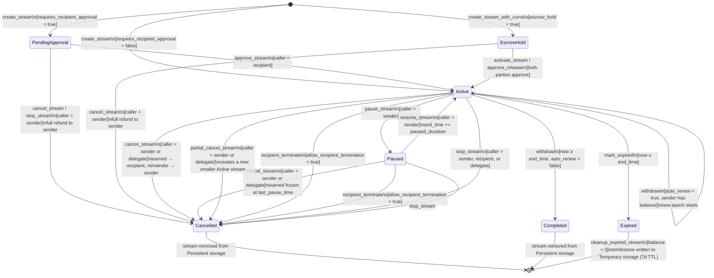
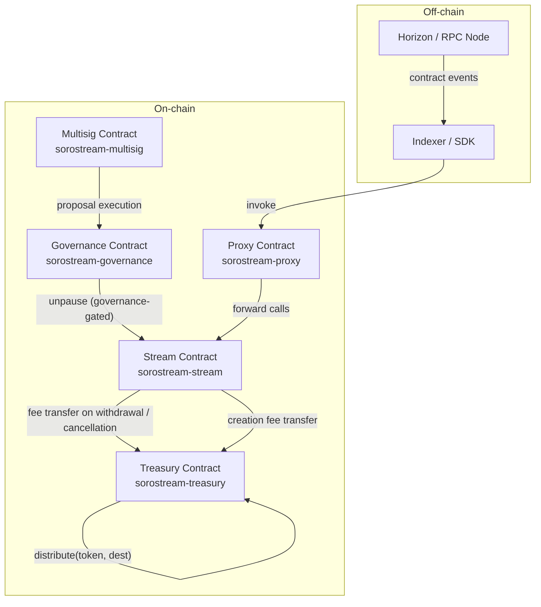

# SoroStream Architecture

> **Maintenance rule:** This document must be updated in every PR that changes
> the storage layout (new key, type change, durability change) or adds / removes
> an entry point. CI does not enforce this automatically — it is a reviewer
> responsibility enforced through the PR checklist.

---

## Stream Lifecycle State Machine

Every stream starts in either `Active` or `PendingApproval` immediately after
`create_stream` returns. The diagram below shows every valid status and the
entry points that drive each transition.

### State descriptions

| State | Meaning |
|-------|---------|
| `Active` | Tokens accrue at `flow_rate` stroops/second. Recipients may `withdraw`. |
| `Paused` | Flow is frozen at `last_pause_time`. No tokens accrue until `resume_stream`. `end_time` is extended by the paused duration on resume. |
| `PendingApproval` | Stream created with `requires_recipient_approval = true`. No tokens accrue. Sender may cancel at zero cost. |
| `EscrowHold` | Stream created with `escrow_hold = true`. Both parties must approve via `approve_release` before vesting begins. |
| `Cancelled` | Ended early. Earned tokens went to recipient; unstreamed remainder returned to sender. Record deleted. |
| `Completed` | Reached natural `end_time`. All tokens distributed. Record deleted. |
| `Expired` | Past `end_time` and explicitly marked via `mark_expired`. Awaiting `cleanup_expired_stream` or `recover_expired`. |

### Transition guard conditions

| Transition | Guard |
|-----------|-------|
| `pause_stream` | Caller = sender. Stream = Active. Contract not globally paused. |
| `resume_stream` | Caller = sender. Stream = Paused. Contract not globally paused. |
| `cancel_stream` | Caller = sender or delegate. Stream = Active, Paused, PendingApproval, or EscrowHold. Sender-locked streams (`sender_locked = true`) may not be cancelled by sender/delegate (EscrowHold/PendingApproval excepted). |
| `partial_cancel_stream` | Same as `cancel_stream`. `cancel_amount < remaining` and `remaining − cancel_amount ≥ flow_rate`. |
| `recipient_terminate` | `allow_recipient_termination = true`. Caller = recipient. Stream = Active or Paused. |
| `stop_stream` | Caller = sender, recipient, or delegate. If `sender_locked`, only recipient may call. Stream = Active, Paused, or PendingApproval. |
| `withdraw` (mid-stream) | Caller = recipient. Stream = Active. `now ≥ cliff_time`. `now ≥ lock_until`. Withdrawal cooldown elapsed. Storage version = current. |
| `withdraw` (completes) | Above, plus `now ≥ end_time`, `auto_renew = false`. |
| `withdraw` (auto-renew) | Above, plus `auto_renew = true`, sender balance ≥ deposit. Requires sender auth. |
| `approve_stream` | Caller = recipient. Stream = PendingApproval. |
| `mark_expired` | Anyone. Stream = Active or Completed. `now ≥ end_time`. |
| `cleanup_expired_stream` | Anyone. Stream = Cancelled, Completed, or Expired with `balance = 0`. |
| `recover_expired` | Caller = sender. `now ≥ end_time`. Grace period (if set) elapsed. |
| `archive_stream` | Caller = sender or recipient. `total_withdrawn + dust = deposit`. |

---

## Contract System Overview

### Contract roles

| Contract | Role |
|----------|------|
| `stream` | Core payment streaming: create, withdraw, cancel, top-up, pause, fee collection, storage versioning, cleanup. |
| `treasury` | Holds accumulated protocol fees. Supports `deposit`, `withdraw_treasury`, `withdraw_all`, `distribute`. |
| `governance` | Time-locked admin actions; can call `unpause` on the stream contract. |
| `multisig` | Multi-signature threshold for executing governance proposals. |
| `proxy` | Transparent upgrade proxy; forwards calls to the current stream implementation. |

---

## Storage Layout — Complete Key Reference

### Notation

- **Instance** — shared across the entire contract instance; cheapest; evicted only when the instance TTL expires.
- **Persistent** — per-entry TTL, never auto-evicted while TTL > 0; the default for user data.
- **Temporary** — auto-evicted when TTL expires; suitable for rate-limit windows, reentrancy locks, and cleanup tombstones.

TTL values are in **ledgers** (1 ledger ≈ 5 seconds on Mainnet).

---

### Instance storage keys

All instance keys are `Symbol`-keyed via `env.storage().instance()`.

| Symbol key | Rust constant | Type | Description |
|------------|--------------|------|-------------|
| `"admin"` | `ADMIN_KEY` | `Address` | Super-admin address set at initialisation. |
| `"paused"` | `PAUSED_KEY` | `bool` | Global emergency-pause flag. |
| `"p_exp"` | `PAUSE_EXPIRES_KEY` | `u64` | Unix timestamp after which auto-unpause fires (0 = no expiry). |
| `"fee_bps"` | `PROTOCOL_FEE_KEY` | `u32` | Protocol withdrawal fee in basis points (100 bps = 1 %). |
| `"treasury"` | `TREASURY_KEY` | `Address` | Treasury contract address for fee accumulation. |
| `"min_dur"` | `MIN_DURATION_KEY` | `u64` | Minimum stream duration in seconds (default 3 600). |
| `"max_dur"` | `MAX_DURATION_KEY` | `u64` | Maximum stream duration in seconds (clamped to protocol hard cap). |
| `"mf_start"` | `MAX_FUTURE_OFFSET_KEY` | `u64` | Maximum future `start_time` offset in seconds (default 365 days). |
| `"version"` | `VERSION_KEY` | `String` | Human-readable contract version string (e.g. `"1.0.0"`). |
| `"stor_ver"` | `STORAGE_VERSION_KEY` | `u32` | **Schema version** written at `initialize` (value: 1). Checked by `create_stream`, `withdraw`, `cancel_stream`, `top_up`. Bumped by `upgrade_storage`. |
| `"max_str"` | `MAX_STREAMS_KEY` | `u32` | Global per-sender stream cap (default 1 000). |
| `"act_cnt"` | `ACTIVE_STREAM_COUNT_KEY` | `u32` | Monotonically-maintained count of currently Active streams. |
| `"str_cnt"` | `STREAM_COUNT_KEY` | `u32` | Monotonically-maintained count of all streams ever created (global index size). |
| `"wl_en"` | `WHITELIST_ENABLED_KEY` | `bool` | Whether recipient whitelisting is enabled. |
| `"ral_en"` | `RECIPIENT_ALLOWLIST_ENABLED_KEY` | `bool` | Whether recipient allowlisting (for regulated payments) is enabled. |
| `"twl_en"` | `TOKEN_WHITELIST_ENABLED_KEY` | `bool` | Whether token whitelisting is enforced. |
| `"wd_cd"` | `WITHDRAWAL_COOLDOWN_KEY` | `u64` | Global withdrawal cooldown in seconds (0 = disabled). |
| `"sc_cd"` | `STREAM_CREATION_COOLDOWN_KEY` | `u64` | Global stream-creation cooldown in seconds (0 = disabled). |
| `"pnd_fee"` | `PENDING_FEE_KEY` | `(u32, u64)` | Pending fee proposal `(new_fee_bps, unlock_timestamp)`. |
| `"cf_xlm"` | `CREATION_FEE_XLM_KEY` | `i128` | Flat XLM creation fee in stroops (0 = disabled). |
| `"xlm_tok"` | `XLM_TOKEN_KEY` | `Address` | XLM SAC token address used to collect creation fees. |
| `"guardian"` | `GUARDIAN_KEY` | `Address` | Guardian address that may call `pause`. |
| `"governance"` | `GOVERNANCE_KEY` | `Address` | Governance address that may call `unpause`. |
| `"grace"` | `GRACE_PERIOD_LEDGERS_KEY` | `u32` | Post-expiry grace period before `recover_expired` is allowed (0 = none). |
| `"exp_win"` | `EXPIRY_WARNING_WINDOW_KEY` | `u32` | Ledgers before `end_time` at which a `StreamExpiryWarning` is emitted (default 17 280 ≈ 24 h). |
| `"ns_cap"` | `NEW_SENDER_STREAM_CAP_KEY` | `u32` | Max concurrent streams for new (non-promoted) senders (default 10). |
| `"sp_thr"` | `SENDER_PROMOTION_THRESHOLD_KEY` | `u32` | Lifetime stream count after which the new-sender cap no longer applies (default 50). |
| `"rl_wl"` | `RATE_LIMIT_WINDOW_LEDGERS_KEY` | `u32` | Sliding-window size for per-sender rate limiting in ledgers (default 720 ≈ 1 h). |
| `"rl_max"` | `RATE_LIMIT_MAX_KEY` | `u32` | Max stream creations per sender per window (default 20). |
| `"max_tok"` | `MAX_STREAMS_PER_TOKEN_KEY` | `u32` | Per-token active stream cap (0 = unlimited). |
| `"cancel_fee"` | `CANCELLATION_FEE_KEY` | `i128` | Early-cancellation fee in basis points applied to the sender refund. |
| `"migrations"` | `APPLIED_MIGRATIONS_KEY` | `Vec<String>` | Ordered list of applied migration version strings. |
| `("min_stake", token)` | — | `i128` | Minimum stake required to create streams for `token` (0 = disabled). |
| `"al_head"` | `AUDIT_HEAD_KEY` | `u32` | Circular audit-log write pointer (head index, mod 20). |
| `"al_len"` | `AUDIT_LEN_KEY` | `u32` | Number of entries currently in the circular audit log (max 20). |
| `("al", idx)` | — | `AuditEntry` | Individual audit log entry slot (20 slots, indices 0–19). |
| `"upg_prop"` | — | `(BytesN<32>, Address, u64)` | Pending WASM upgrade proposal `(wasm_hash, proposer, created_at)`. |
| `"upg_exp"` | — | `u64` | Expiry ledger for the pending upgrade proposal. |

---

### Persistent storage keys

All persistent keys are stored via `env.storage().persistent()` with per-entry TTLs.

#### Stream records and global index

| Key pattern | Type | TTL (ledgers) | Description |
|-------------|------|--------------|-------------|
| `stream_id: u64` | `Stream` | Varies (bumped by `bump_stream_ttl`) | Full stream struct for each live stream. |
| `("gi", idx: u32)` | `u64` | Inherited | Global stream enumeration; slot `idx` holds a `stream_id`. |

#### Sender / recipient / tag indexes (counter + slot pattern)

| Key pattern | Type | Description |
|-------------|------|-------------|
| `("sc", sender: Address)` | `u32` | Count of all slots ever written for `sender` (never decrements). |
| `("s", sender, idx: u32)` | `u64` | Slot `idx` in sender's stream-ID list (swap-and-pop on removal). |
| `("rc", recipient: Address)` | `u32` | Count of all slots for `recipient`. |
| `("r", recipient, idx: u32)` | `u64` | Slot `idx` in recipient's stream-ID list. |
| `("asc", sender)` | `u32` | Active-only sender index slot count. |
| `("as", sender, idx: u32)` | `u64` | Active-only sender index slot. |
| `("tc", tag: String)` | `u32` | Count of slots for `tag`. |
| `("t", tag, idx: u32)` | `u64` | Slot `idx` in tag's stream-ID list. |

#### Per-stream auxiliary data

| Key pattern | Type | Description |
|-------------|------|-------------|
| `("vt", stream_id)` | `Vec<VestingTranche>` | Step-vesting tranche list (only present for `is_step_vesting = true` streams). |
| `("hb", stream_id)` | `i128` | Holdback escrow amount in stroops. |
| `("del", stream_id)` | `Address` | Authorised delegate address for the stream. |
| `("evn", stream_id)` | `u64` | Monotonic per-stream event nonce (prevents event replay). |
| `("exp_em", stream_id)` | `bool` | Whether the expiry warning event has already been emitted. |
| `("stag", stream_id)` | `String` | Human-readable tag attached to the stream. |
| `("slip", stream_id)` | `(i128, u32)` | Slippage params `(reference_price, max_slippage_bps)`. |

#### Dual-stream auxiliary data

| Key pattern | Type | Description |
|-------------|------|-------------|
| `("ds", stream_id, "tok2")` | `Address` | Second token address for dual-token streams. |
| `("ds", stream_id, "dep2")` | `i128` | Second token deposit amount. |
| `("ds", stream_id, "wd2")` | `i128` | Total withdrawn from second token. |

#### Global per-sender accounting

| Key pattern | Type | Description |
|-------------|------|-------------|
| `("sl_cnt", sender)` | `u32` | Lifetime stream count for sender (used for promotion check). |
| `("lc", sender)` | `u64` | Timestamp of sender's last stream creation (creation-cooldown guard). |
| `("bn", sender)` | `u64` | Batch nonce counter for `batch_create_stream`. |
| `("n", sender, nonce: u64)` | `bool` | Nonce-used marker for `create_stream` deduplication. |
| `("sl", sender)` | `u32` | Per-sender stream-limit override (overrides global `MAX_STREAMS_KEY`). |

#### Token-scoped data

| Key pattern | Type | Description |
|-------------|------|-------------|
| `("tsc", token)` | `u32` | Current active stream count for `token`. |
| `("tft", token)` | `u32` | Per-token fee tier override in basis points. |
| `("max_dep", token)` | `i128` | Maximum single-stream deposit for `token` (0 = unlimited). |
| `(FEES_COLLECTED_KEY, token)` | `i128` | Accumulated protocol fees for `token` (drained by `sweep_fees`). |

#### Access control lists

| Key pattern | Type | Description |
|-------------|------|-------------|
| `("wl", recipient)` | `bool` | Recipient whitelist entry. |
| `("ral", recipient)` | `bool` | Recipient allowlist entry (regulated payments). |
| `("fe", addr)` | `bool` | Fee-exemption list entry. |
| `("bl", addr)` | `bool` | Blocklist entry. |
| `("twl", token)` | `bool` | Token whitelist entry. |
| `("rle", addr)` | `bool` | Rate-limit exemption list entry. |
| `("stk", sender, token)` | `i128` | Staked collateral balance for `sender` / `token` pair. |
| `("stk_p", sender, token)` | `(i128, u64)` | Pending unstake `(amount, unlock_timestamp)`. |

#### Federation registry

| Key pattern | Type | Description |
|-------------|------|-------------|
| `("fed", federation_name: String)` | `Address` | Stellar address registered for a federation name. |

#### Stream transition history

| Key pattern | Type | Description |
|-------------|------|-------------|
| `("str_tr", stream_id, idx: u32)` | `StreamTransition` | Circular buffer of last 10 lifecycle transitions per stream. |
| `("str_tr_h", stream_id)` | `u32` | Head pointer for the transition buffer. |
| `("str_tr_l", stream_id)` | `u32` | Current length of the transition buffer (max 10). |

---

### Temporary storage keys

| Key pattern | Type | TTL | Description |
|-------------|------|-----|-------------|
| `"re_lk"` | `bool` | Auto-cleared | Global reentrancy lock. Set at the start of mutating entry points; cleared before return. |
| `("rl", addr)` | `(u32, u32)` | `window_ledgers` | Per-sender rate-limit state `(window_start_ledger, count_in_window)`. TTL = one full window. |
| `("cln_ts", stream_id)` | `(u32, u64)` | `CLEANUP_TTL_LEDGERS` (120 960 ≈ 7 days) | **Cleanup tombstone** written by `cleanup_expired_stream`. Stores `(status_discriminant, end_time)` so lightweight proof-of-past-existence is available for ~7 days after cleanup. |

---

## Storage Schema Version

The key `"stor_ver"` (Instance storage, type `u32`) was introduced in **feat/50**.

| Version | Written by | Migration logic |
|---------|-----------|----------------|
| 1 | `initialize` (all new deployments) | Initial version — no data transformation. |
| 1 | `upgrade_storage` (legacy deployments) | Stamps the key on contracts initialised before feat/50. No data transformation. |

**Guard:** `create_stream`, `withdraw`, `cancel_stream`, and `top_up` all call
`assert_storage_version` as their first action after the reentrancy lock is set.
A missing or outdated version key causes `Error::StorageVersionMismatch` — the
call is rejected and the admin must run `upgrade_storage` first.

---

## Access Control Matrix

The table below maps every public entry point to the identity that is authorised to call it. "Admin" means the super-admin stored under `"admin"` in Instance storage. Role-based variants are noted where applicable.

### Lifecycle entry points

| Entry point | Authorised caller | Notes |
|-------------|------------------|-------|
| `initialize` | Anyone (once only) | Reverts `AlreadyInitialized` on second call. |
| `upgrade` | Admin | Requires `require_auth()` on the stored admin address. |
| `migrate` | Admin | Records version string in `applied_migrations`. |
| `upgrade_storage` | Admin | Bumps `stor_ver`; fails if already current. |
| `set_admin` | Admin | Replaces stored admin address. |
| `emergency_pause` | Admin | Sets `paused = true`, stamps `pause_expiry`. |
| `emergency_resume` | Admin | Clears `paused`. |
| `role_emergency_pause` | Admin **or** EmergencyPause role | Role-aware variant. |
| `role_emergency_resume` | Admin **or** EmergencyPause role | Role-aware variant. |
| `pause` | Guardian | Guardian is a separately stored address. |
| `unpause` | Governance | Governance is a separately stored address. |

### Stream creation

| Entry point | Authorised caller | Notes |
|-------------|------------------|-------|
| `create_stream` | Sender (`require_auth`) | Checks token whitelist, rate limit, sender cap, blocklist. |
| `create_stream_with_sponsor` | Sender | Sponsor funds the deposit; sender controls lifecycle. |
| `create_stream_scheduled` | Sender | Accepts a future `start_time` within `max_future_start_offset`. |
| `create_stream_with_milestones` | Sender | Timestamp-gated milestone stream. |
| `create_stream_with_approval_milestones` | Sender | Oracle/multisig-gated milestone stream. |
| `batch_create_stream` | Sender | All-or-nothing batch; checks per-sender batch nonce. |

### Stream mutation

| Entry point | Authorised caller | Notes |
|-------------|------------------|-------|
| `withdraw` | Recipient | Checks cliff, lock, cooldown, storage version. |
| `batch_withdraw` | Recipient | Recipient must be the invoker. |
| `cancel_stream` | Sender **or** Delegate | `sender_locked = true` blocks sender/delegate (not EscrowHold/PendingApproval). |
| `batch_cancel_stream` | Sender | All streams in batch must belong to caller. |
| `stop_stream` | Sender, Recipient, **or** Delegate | `sender_locked` blocks sender only. |
| `partial_cancel_stream` | Sender **or** Delegate | Creates a smaller replacement stream. |
| `recipient_terminate` | Recipient | Only when `allow_recipient_termination = true`. |
| `top_up` | Sender **or** Delegate | Token must match stream token. Checks storage version. |
| `pause_stream` | Sender | Stream must be Active. |
| `resume_stream` | Sender | Stream must be Paused. |
| `approve_stream` | Recipient | Transitions PendingApproval → Active. |
| `lock_stream` | Sender | Irrevocable; sets `sender_locked = true`. |
| `transfer_sender` | Current sender | Stream must be Active / Paused / PendingApproval / EscrowHold. |
| `transfer_recipient` | Current recipient | Blocked if `non_transferable = true`. Settles accrued balance to old recipient first. |
| `activate_stream` | Sender | EscrowHold → Active (if recipient also approved). |
| `approve_release` | Sender **or** Recipient | EscrowHold dual-approval path. |
| `update_stream_rate` | Sender | Settles accrued balance before applying new rate. |
| `set_delegate` | Sender | Delegate may cancel/top-up/bump-ttl on behalf of sender. |
| `revoke_delegate` | Sender | Removes delegate. |

### Milestone & holdback

| Entry point | Authorised caller | Notes |
|-------------|------------------|-------|
| `release_milestone` | Sender | Not allowed when `milestone_approver` is set. |
| `approve_milestone` | `milestone_approver` address | One approval per pending milestone. |
| `release_holdback` | Sender **or** Delegate | Transfers holdback to recipient. |
| `claw_back_holdback` | Sender **or** Delegate | Returns holdback to sender. |
| `clawback_stream` | Token issuer (`StellarAssetClient.admin()`) | Reclaims contract escrow via SAC clawback. |

### Expiry, cleanup, and archival

| Entry point | Authorised caller | Notes |
|-------------|------------------|-------|
| `mark_expired` | Anyone | Stream must be Active/Completed with `now ≥ end_time`. |
| `cleanup_expired_stream` | Anyone (incentivised) | Stream must be zero-balance Cancelled/Expired/Completed. Pays optional XLM reward from treasury. Writes Temporary tombstone (7-day TTL). |
| `recover_expired` | Sender | Stream must be expired and grace period elapsed. |
| `sweep_expired` | Anyone | Batch removal of expired fully-withdrawn streams. |
| `archive_stream` | Sender **or** Recipient | Stream must be fully settled (`total_withdrawn + dust = deposit`). |
| `bump_stream_ttl` | Anyone | Extends Persistent TTL; no auth required. |

### Admin / protocol configuration

| Entry point | Authorised caller | Notes |
|-------------|------------------|-------|
| `set_protocol_fee` | Admin | Initiates 7-day timelock via `write_pending_fee_proposal`. |
| `execute_fee_change` | Anyone | Applies pending fee after timelock expires. |
| `set_cancellation_fee` | Admin **or** FeeManager role | Max 10 000 bps. |
| `set_token_fee_tier` | Admin | Per-token fee override. |
| `remove_token_fee_tier` | Admin | Reverts to global default. |
| `sweep_fees` | Admin | Transfers accumulated fees to destination. |
| `add_fee_exempt` / `remove_fee_exempt` | Admin | |
| `set_whitelist_enabled` | Admin | |
| `set_token_whitelist_enabled` | Admin | Disabling is rejected (`NotAuthorized`). |
| `add_token_to_whitelist` / `remove_token_from_whitelist` | Admin | |
| `add_to_blocklist` / `remove_from_blocklist` | Admin | |
| `set_rate_limit_window` / `set_rate_limit_max` | Admin | |
| `add_rate_limit_exempt` / `remove_rate_limit_exempt` | Admin | |
| `set_max_streams` | Admin | Global per-sender cap. |
| `set_sender_stream_limit` | Admin | Per-sender override. |
| `set_max_streams_per_token` | Admin | |
| `set_max_deposit_per_token` | Admin | |
| `set_creation_fee` | Admin | Sets both fee amount and XLM SAC address. |
| `set_treasury_address` | Anyone | **Note:** not auth-gated in current code; tighten if deploying to production. |
| `set_min_duration` / `set_max_duration` | Admin | |
| `set_max_future_start_offset` | Admin | |
| `set_withdrawal_cooldown` | Admin | |
| `set_stream_creation_cooldown` | Admin | |
| `set_grace_period_ledgers` | Admin | |
| `set_expiry_warning_window` | Admin | Must be > 0. |
| `set_new_sender_stream_cap` | Admin | |
| `set_sender_promotion_threshold` | Admin | |
| `register_federation` / `unregister_federation` | Admin | |
| `recalibrate_stats` | Admin | Rescans all streams to fix counter drift. |
| `set_slippage_params` | Sender | |
| `update_metadata_uri` | Sender | |
| `update_metadata` | Sender | 256-byte cap; stored in Persistent with ~24 h TTL. |

### Role assignment

| Entry point | Authorised caller |
|-------------|------------------|
| `assign_fee_manager` / `revoke_fee_manager` | Admin only |
| `assign_emergency_pause_role` / `revoke_emergency_pause_role` | Admin only |
| `assign_analytics_role` / `revoke_analytics_role` | Admin only |

### Staking

| Entry point | Authorised caller |
|-------------|------------------|
| `stake` | Sender (staking caller) |
| `initiate_unstake` | Sender |
| `complete_unstake` | Sender (after `STAKE_UNLOCK_DELAY` = 7 days) |
| `set_min_stake_amount` | Admin **or** FeeManager role |
| `slash_stake` | Admin only |

### Read-only entry points

All `get_*`, `query_streams`, `is_*`, `simulate_claimable`, `remaining_quota`, `get_stream_health` — no auth required.

---

## Stream ID Generation

Stream IDs are the first 8 bytes of `SHA-256(sender_xdr ‖ recipient_xdr ‖ start_time_be8 ‖ nonce_be8)`, interpreted as a big-endian `u64`. Full algorithm and collision analysis: see §"Stream ID Generation" in the previous version of this document (preserved in git history).

Key properties:
- Deterministic and predictable by both parties before confirmation (by design).
- Not a secret — all mutations require `require_auth()`.
- `stream_exists` guard + up-to-3 nonce retries protect against the astronomically unlikely accidental collision.

---

## PR Review Checklist for Storage / Entry Point Changes

Every PR that changes storage layout or adds an entry point must:

- [ ] Update the relevant section of this document (`ARCHITECTURE.md`).
- [ ] Update `contracts/stream/STORAGE.md` with the new key(s) and encoding.
- [ ] Regenerate storage layout snapshots if any `#[contracttype]` changed: `UPDATE_EXPECT=true cargo test -- storage_layout_snapshot_tests`.
- [ ] Add the new entry point to the access control matrix above.
- [ ] Ensure all new storage keys use the correct durability tier (see CONTRIBUTING.md §"Contract Storage").
